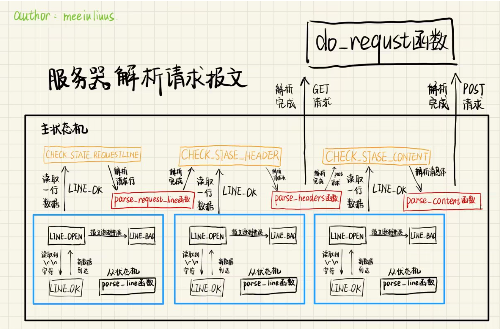
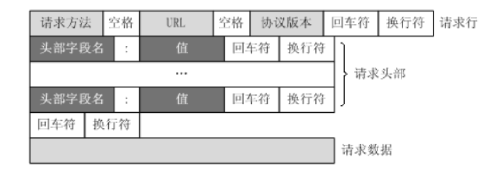
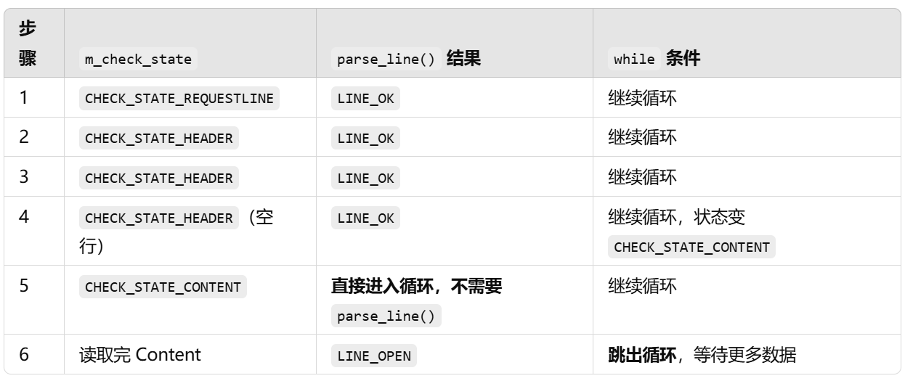
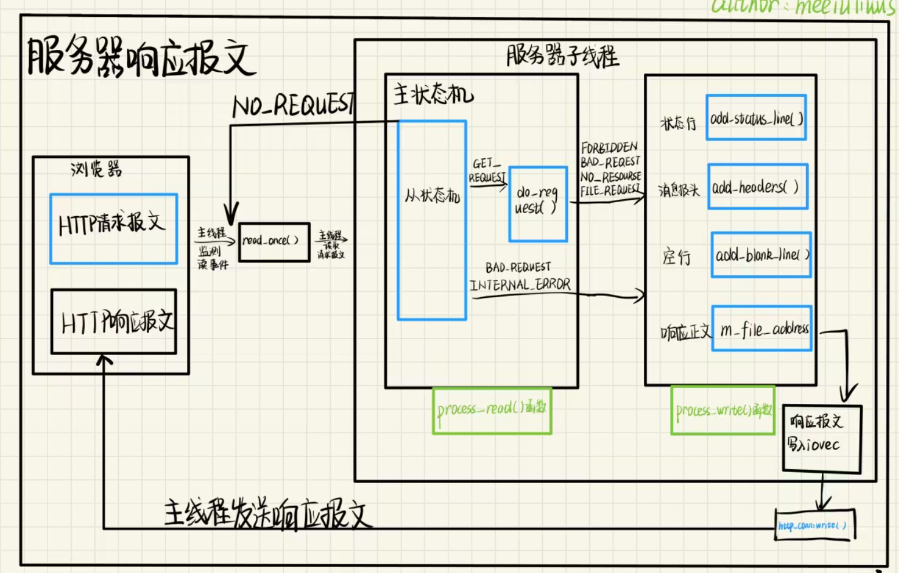
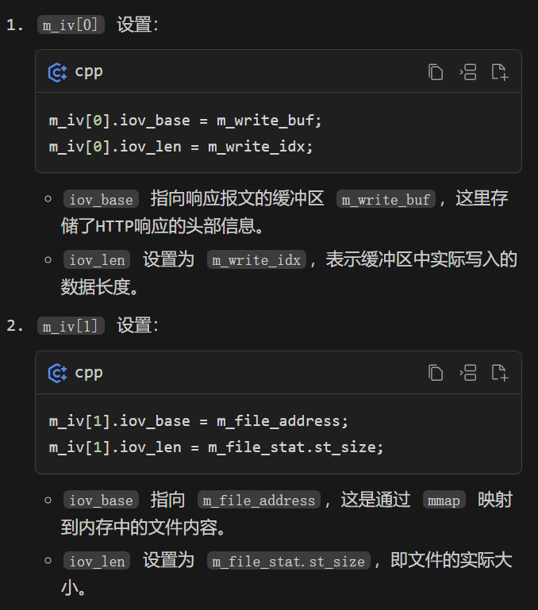

·LT模式（水平触发）：只进行一次 recv 调用。
·ET模式（边缘触发）：在一个循环中持续读取数据，直到出错或者读取完成

    ssize_t recv(int sockfd, void *buf, size_t len, int flags)：
        正值（> 0）：
            含义：成功接收到数据。
                返回值表示实际接收到的字节数。
                这个值可能小于请求的长度（len参数），这是正常的，表示还有更多数据等待读取。

        零（== 0）：
            含义：连接已正常关闭。
                表示对方已经调用了 close() 或 shutdown() 来关闭连接。
        
        负值（-1）：
            含义：发生错误。
                需要检查 errno 来确定具体的错误类型。常见的错误包括：
                EAGAIN 或 EWOULDBLOCK：在非阻塞模式下，当前没有数据可读。
                ECONNRESET：连接被对方重置。
                EINTR：系统调用被信号中断。
                ENOTCONN：套接字未连接。

————————————————————————————————————————————————————————
主从状态机：解析报文
    **从状态机负责读取报文的一行，主状态机负责对该行数据进行解析，主状态机内部调用从状态机，从状态机驱动主状态机。**
    
1.怎么读取一行：
    在HTTP报文中，每一行的数据由\r\n作为结束字符，空行则是仅仅是字符\r\n，而在c中判断一个字符串是否结束的标志就是看是否遇到‘\0’。
    将\r\n替换成\0\0，可以用 printf("%s") 或 strcmp() 之类的字符串处理函数操作。

2.从状态机处理过程：
    parse_line() 找到一行并用 '\0' 标记其结束。
    get_line() 返回指向这行开始的指针。
    处理完这行后，m_start_line 被更新为下一行的开始位置。（m_start_line = m_checked_idx）
    重复这个过程，直到处理完整个请求。
3.主状态机的过程：
    a.报文格式：
        

    b.报文内容示例：
        GET /index.html HTTP/1.1\r\n
        Host: example.com\r\n
        Content-Length: 10\r\n
        \r\n
        abcdefghij

    c.解析逻辑：
    while ((m_check_state == CHECK_STATE_CONTENT && line_status == LINE_OK) 
        || ((line_status = parse_line()) == LINE_OK)) {
        // 解析逻辑
    }

    a.解析请求行 & 头部时：
        需要 parse_line() 解析出完整的一行数据（返回 LINE_OK），否则等待更多数据。

    b.解析请求体时：
        由于请求体可能是二进制数据，不一定有换行符，因此 parse_line() 可能不适用。
        需要靠 m_check_state == CHECK_STATE_CONTENT 直接触发解析，不依赖 parse_line()。

    c.循环条件的作用：
        在GET请求报文中，每一行都是\r\n作为结束，所以对报文进行拆解时，仅用从状态机的状态line_status=parse_line()==LINE_OK语句即可。
        但，在POST请求报文中，消息体的末尾没有任何字符，所以不能使用从状态机的状态，这里转而使用主状态机的状态作为循环入口条件。
        解析完消息体后，报文的完整解析就完成了，但此时主状态机的状态还是CHECK_STATE_CONTENT，也就是说，符合循环入口条件，还会再次进入循环，这并不是我们所希望的。
        为此，增加了该语句，并在完成消息体解析后，将line_status变量更改为LINE_OPEN，此时可以跳出循环，完成报文解析任务。
    

————————————————————————————————————————————————————————————

设置 iovec 结构体数组作用：
    用于后续的 writev 系统调用。iovec 结构体用于在一次系统调用中执行多个缓冲区的I/O操作，这种技术称为"散布/聚集"（scatter/gather）I/O。
    
    这种设置允许服务器在一次 writev 调用中同时发送HTTP响应头和文件内容，提高了I/O效率。具体来说：
        第一个 iovec 结构（m_iv[0]）用于发送HTTP响应头。
        第二个 iovec 结构（m_iv[1]）用于发送文件内容。
    通过这种方式，服务器可以在不需要将整个文件内容复制到响应缓冲区的情况下，直接从文件映射的内存区域发送数据，既提高了效率，又节省了内存使用。